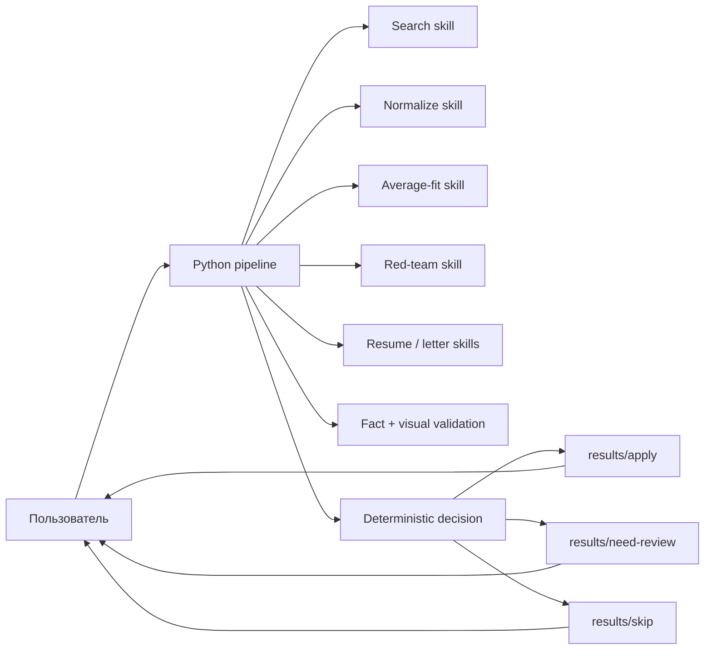
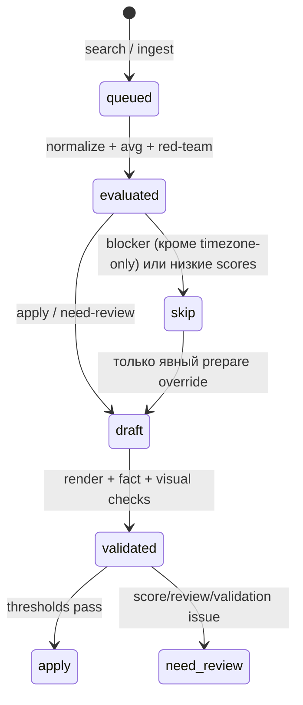

# Архитектура локального job-search workflow

## Цель и границы

Система ищет вакансии, нормализует их, независимо оценивает совпадение с
master-CV, готовит одностраничное резюме и черновик сопроводительного письма и
складывает проверяемые пакеты в `results/`.

Система принципиально:

- не отправляет отклики;
- не входит на сайты и не загружает файлы работодателю;
- не использует OpenAI Platform API или API key;
- запускает модельные этапы через `codex exec` и сохранённый ChatGPT login;
- оставляет человеку окончательное решение и внешний submit.

## Почему это не «рой автономных агентов»

Главный управляющий компонент — детерминированный Python pipeline. Модель
используется только там, где нужна семантика: web-search, разбор текста,
оценка требований, написание и проверка материалов.



Такой дизайн предотвращает потерю состояния, случайное внешнее действие и
необъяснимое изменение порогов моделью. Repo skills задают повторяемые
семантические контракты. Файлы `.codex/agents/` дают те же роли для
интерактивной работы, но production-like запуск выполняет pipeline.

## Слои

### 1. Источник истины

- `master/master-cv-en.md`, `master/master-cv-ru.md` — читаемые master-CV.
- `master/sources/` — неизменяемые retained sources.
- `master/facts.json` — машинный allowlist фактов с evidence pointers,
  конфликтами, статусами и ограничениями.
- `master/fact-audit.md` — решения по конфликтам и границам утверждений.
- `scripts/audit_facts.py` — проверка структуры, уникальности и каждого
  `path:line` указателя.

Сгенерированное резюме никогда не становится источником фактов.

### 2. Семантические тулы

Каждый skill имеет узкую ответственность:

- `find-vacancies` — поиск и нормализация, без scoring;
- `evaluate-vacancy` — один из двух независимых scoring-проходов;
- `write-tailored-resume` — только allowlisted факты и фиксированный формат;
- `write-cover-letter` — короткий evidence-based draft;
- `validate-application-package` — red-team фактов и визуальная проверка.

Average-fit и red-team не читают ответы друг друга. Их объединяет Python по
порогам из `config/thresholds.json`.

### 3. Рендер

Копия исходного `md-renderer` находится в `md-renderer/`.

- `RESUME_RENDERING_AGENT.md` сохранён как исторический алгоритм.
- `ONE_PAGE_RESUME_RULES.md` — активные правила.
- `themes/default.json` — базовая одноколоночная A4-тема.
- `scripts/fit_resume.py` — render/fit loop.
- `scripts/inspect_pdf.py` — page count, fill и bounds.
- PNG проверяется отдельным визуальным Codex-проходом.

Активная цель — одна A4-страница, Times New Roman 9 pt, не менее 97% рабочей
высоты без учёта полей, без clipping, overlap и переноса строк
company/title/date. Иерархия
строится чёрными serif-заголовками, серыми линиями и синими контактными
ссылками. Белые background rectangles Chromium не считаются контентом.

### 4. Состояние и результаты

SQLite хранит индекс и текущий статус, но сами пакеты являются переносимыми
папками:

```text
results/<category>/<company>/<job-id>/
├── vacancy-source.md
├── vacancy.json
├── avg-match.json
├── red-team-match.json
├── decision.json
├── resume.md             # apply / need-review
├── resume.pdf            # apply / need-review
├── resume-preview.png    # apply / need-review
├── cover-letter.md       # apply / need-review
├── validation-summary.json
├── logs/
└── manifest.json
```

`manifest.json` фиксирует SHA-256 и размер каждого файла.

## Машина состояний



Команда `prepare` — единственный способ сознательно подготовить материалы для
автоматического `skip`. Она возобновляема после прерванного модельного этапа.

## Классификация

По умолчанию:

- `apply`: avg ≥ 75 и red-team ≥ 60, без hard blocker;
- `need-review`: avg ≥ 60 и red-team ≥ 45;
- `skip`: ниже порогов или есть hard blocker.

Финальная категория вычисляется кодом. Модель возвращает score, evidence map и
причины, но не перемещает папки.

Несовпадение часового пояса, GMT или UTC offset само по себе не снижает score и
не считается hard blocker. Pipeline детерминированно удаляет ошибочно
поставленный timezone-only blocker перед классификацией и сохраняет его в
`ignored_timezone_blockers` для аудита. Явные ограничения по географии, визе,
языку, гражданству, графику и clearance остаются hiring blockers/risks, но не
попадают в `missing_skills`.

`missing_skills` формируется для `skip` и `need-review`: pipeline объединяет
оба независимых отчёта, сопоставляет перефразированные требования по токенам,
снимает gap при наличии подтверждающего `fact_id` в другом отчёте и сохраняет
не более восьми технических или функциональных пробелов.

## Использование лимитов Codex

- Каждый этап запускается отдельным ephemeral `codex exec`.
- Локальные этапы игнорируют global config и отключают лишние plugins, apps,
  browser, computer-use, image generation и multi-agent context.
- Web-доступ включается только для поиска.
- Для нормализации, поиска и visual QA используется low reasoning; для
  scoring и writing — medium.
- `skip` не тратит лимиты на резюме и письмо.
- Модель закреплена в `config/codex-runtime.json`, чтобы версия CLI и доступная
  модель были воспроизводимы.

Это использует квоты текущего Codex/ChatGPT плана. Измерить или зарезервировать
точный остаток лимита локальный pipeline не может; ошибки quota/rate limit
остаются в stage logs, а незавершённый пакет можно продолжить.

## Модель угроз и ошибок

- Текст вакансии считается недоверенным и не может менять инструкции.
- Поиск не делает sign-in, upload или submit.
- Любой неподтверждённый must-have остаётся `missing` или `unknown`.
- Пропущенная оговорка, неверная дата или технология блокируют validation.
- Ошибка одного job не останавливает другие вакансии в `process-all`.
- Дубликаты определяются по URL и SHA-256 текста.
- Результаты не перезаписываются молча.

## Точки расширения

- Новые источники поиска добавляются внутрь `find-vacancies`, не в scoring.
- Новые типы документов оформляются отдельным skill и schema.
- Пороговые значения меняются только в `config/thresholds.json`.
- После подтверждения спорного факта обновляются source/master,
  `facts.json`, версия реестра и `fact-audit.md`.
- Autoapply, если он когда-либо понадобится, должен быть отдельным модулем с
  явным подтверждением пользователя и не должен менять этот review-first
  pipeline.
